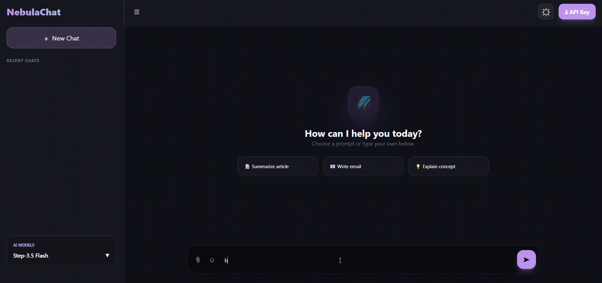
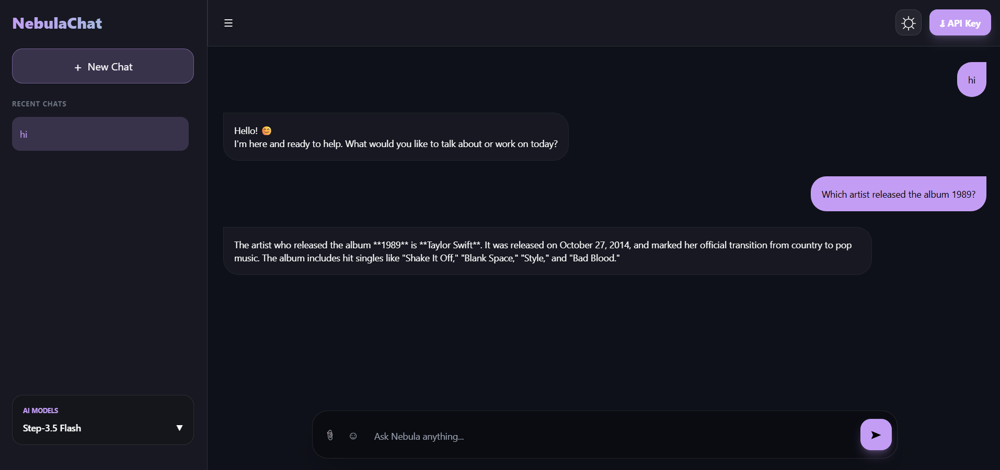
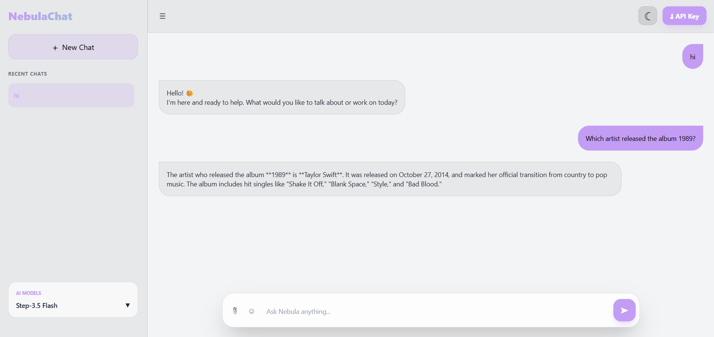
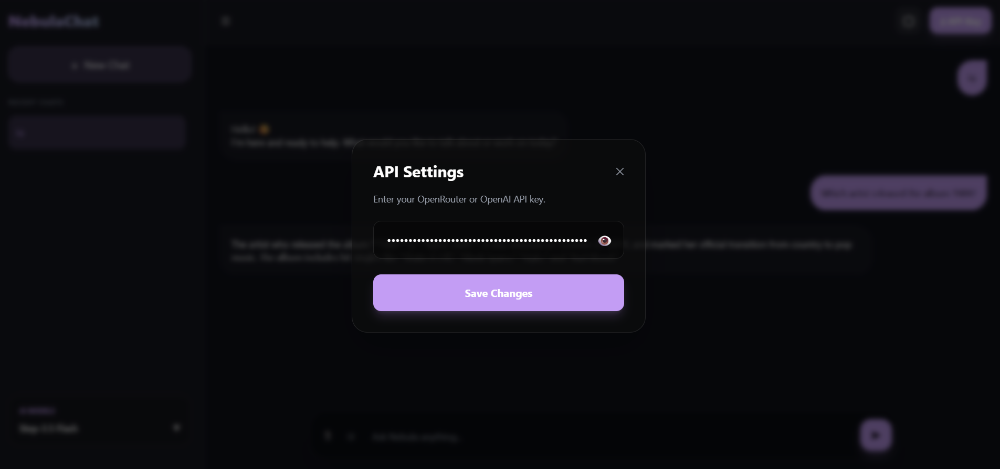

# 🌌 NebulaChat AI - Ultra

NebulaChat is a high-performance, aesthetically pleasing AI chat interface designed for seamless interaction with modern Large Language Models (LLMs). Built with a focus on **Glassmorphism**, it offers a premium, modern experience for both desktop and mobile users.

 **

---

## ✨ Features

* **Premium Glassmorphic UI:** A beautiful interface with backdrop blur effects, smooth transitions, and a futuristic vibe.
* **Multi-Model Integration:** Seamlessly switch between models like `Step-3.5 Flash` and `GPT-4o Mini`.
* **Dual Theme Support:** Switch between **Deep Space (Dark)** and **Cloud (Light)** modes with custom animated icons (☼ and ☾).
* **Secure API Management:** * Localized storage (API keys never leave your browser).
    * **Show/Hide Toggle:** A modern eye-icon toggle to keep your keys private while configuring settings.
* **Multimodal Capabilities:** Supports multiple image uploads with live previews and removal options before sending.
* **Chat History:** Built-in sidebar to track and manage your previous conversations.
* **Emoji Picker:** Integrated quick-access emojis for expressive chatting.

---

## 📸 Screenshots

| Dark Mode Interface | Light Mode Interface |
|---|---|
|  |  |

| API Settings (Hidden) | API Settings (Visible) |
|---|---|
|  

---

## 🛠️ Tech Stack

* **Styling:** [Tailwind CSS](https://tailwindcss.com/)
* **Core:** Vanilla JavaScript (ES6+)
* **Design:** Custom CSS Glassmorphism & Keyframe Animations
* **API:** [OpenRouter API](https://openrouter.ai/)

---

## 🚀 Quick Start

### 1. Clone the repository
```bash
git clone [https://github.com/minuyuhansi/Nebula-ChatBot.git]
